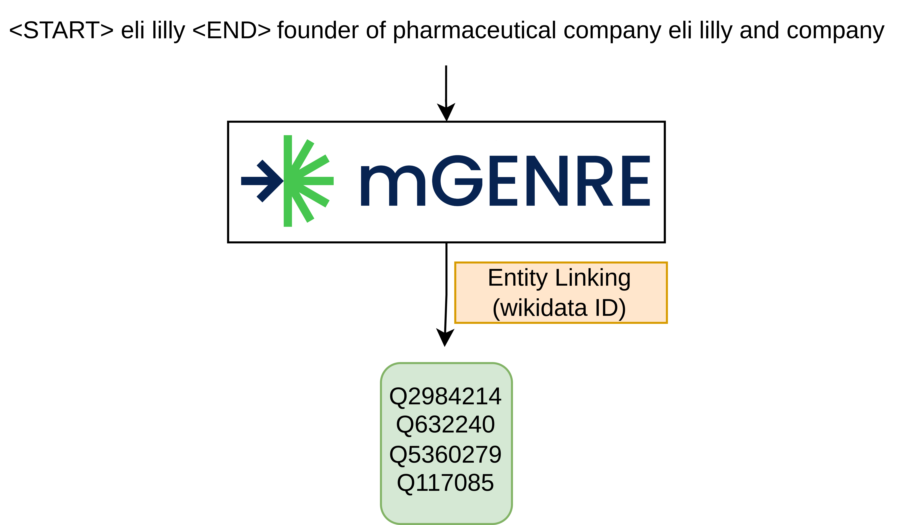

# Context-enriched multilingual named entity recognition using knowledge bases. 

This is the code for [IXA/Cogcomp at SemEval-2023 Task 2: Context-enriched Multilingual Named Entity Recognition using Knowledge Bases](https://arxiv.org/abs/2304.10637) paper: https://multiconer.github.io/  


<p align="center">

</p>

## Installation

This repository contains a sightly modified version of the fairseq and GENRE code
(I changed a very small number of lines to fix a few problems I had with the original code).
The original implementations are available here:

* Fairseq version compatible with GENRE: https://github.com/nicola-decao/fairseq/tree/fixing_prefix_allowed_tokens_fn
* GENRE: https://github.com/facebookresearch/GENRE

### Requirements
You will need to install these dependencies to run the code

**IMPORTANT**: The version of fairseq compatible with GENRE does not work with Python >= 3.11. Please use Python 3.9 to ensure that everything works correctly.  
```
Pytorch (1.12 tested but should work with 1.6+: https://pytorch.org/get-started/locally/)
Huggingface-Transformers (pip install transformers)
Huggingface-Datasets (pip install datasets)
Huggingface-Evaluate (pip install evaluate)
numpy (pip install numpy)
seaborn (pip install seaborn)
matplotlib (pip install matplotlib)
accelerate (pip install accelerate)
tqdm (pip install tqdm)
pymediawiki (pip install pymediawiki)
wikidata (pip install Wikidata)
tabulate (pip install tabulate)
seqeval (pip install seqeval)
```

You need to install the version of fairseq compatible with GENRE distributed in this repository.
If you don't use this version, mGENRE will not work. 
```bash
cd fairseq
pip install --editable ./
```

### Data and Models
You also need to download the mGENRE model together with the TRIE and tittle2wikidataID dictionary.
Run the following commands to download the model and the dictionary.
```bash
sh get_genre.sh
```

If you want to download the [MultiCoNER2 dataset](https://multiconer.github.io/) run:
```bash
aws s3 cp --no-sign-request s3://multiconer/multiconer2023/ multiconer2023/ --recursive
```

You will need to clean the data, you can use our script. Set the path to folder where you downloaded the data in your computer.
```bash
python3 preprocess_MultiCoNER2.py -i ./multiconer2023
```


## Citation

```
@misc{garcíaferrero2023ixacogcomp,
      title={IXA/Cogcomp at SemEval-2023 Task 2: Context-enriched Multilingual Named Entity Recognition using Knowledge Bases}, 
      author={Iker García-Ferrero and Jon Ander Campos and Oscar Sainz and Ander Salaberria and Dan Roth},
      year={2023},
      eprint={2304.10637},
      archivePrefix={arXiv},
      primaryClass={cs.CL}
}
```
Consider also citing the  [mGENRE](https://aclanthology.org/2022.tacl-1.16/) and [XLM-RoBERTa](https://aclanthology.org/2020.acl-main.747/) papers.

## Usage
The scripts to reproduce the results in the shared task can be found in the [reproduce_MultiCoNER2](reproduce_MultiCoNER2/) folder.

### Entity Boundary Detection
<p align="center">

</p>

This is the task of detecting the boundaries of the entities in the input text.
The input is a text in the conll tsv format. It should have label with only B-ENTITY and I-ENTITY classes.
If you have run the `preprocess_MultiCoNER2.py` script, you will find the data into the 'multiconer2023/entity' folder. 
If you are using, you can can run the `fine2ent.py` script to convert the fine-grained labels to entity boundaries. Change the path to the data in your computer inside the script.
```bash
python3 fine2ent.py --input_file ./multiconer2023/EN-ENglish/en_train.conll --output_file ./multiconer2023/entity/en_train.conll
```
See [data_examples/entity_boundary.conll](data_examples/entity_boundary.conll) for an example of the input format.

We provide our script for token classification with is a binding of the [Hugginface's Token classification script](https://github.com/huggingface/transformers/tree/main/examples/pytorch/token-classification).
You can use any Token Classification script you want, for example [flair](https://github.com/flairNLP/flair) or [SpaCy](https://spacy.io/). If you want to use our Token Classification script, you can run:
```bash
cd TokenClassification 

python3 run_tokenclass.py \
--train_file ../multiconer2023/entity/en_train.conll \
--dev_file ../multiconer2023/entity/en_dev.conll \
--test_file ../multiconer2023/entity/en_test.conll \
--model_name xlm-roberta-large \
--output_dir ../results/entity_boundaries/en \
--num_train_epochs 8 \
--batch_size 16 \
--gradient_accumulation_steps 1 \
--learning_rate 2e-5 \
--max_seq_length 256 \
--number_of_experiments 5 \
--experiment_name entity_boundaries_en \
--encoding iob2 \
--lr_scheduler_type cosine \
--fp16
```
number_of_experiments is the number of model you want to train. The script will train 5 models and use voting as the ensemble method.
At the end you will get a `test.model_predictions.tsv` file in the output directory.

### Entity Linking
<p align="center">

</p>

For each entity boundary detected in the previous step, we need to link it to a Wikidata ID.
We use mGENRE to do this task. You can run the `run_genre.py` script to link the entities. 

For the train and development set, we use the gold label boundaries
```bash
python3 run_genre.py \
--tsv_path ./multiconer2023/finegrained/en_train.conll \
--batch_size 32 \
--output_path ./results/genre/en/en_train.json

python3 run_genre.py \
--tsv_path ./multiconer2023/finegrained/en_dev.conll \
--batch_size 32 \
--output_path ./results/genre/en/en_dev.json
```

For the test set, we use the predicted boundaries from the previous step.
```bash
python3 run_genre.py \
--tsv_path ./results/entity_boundaries/en/test.model_predictions.tsv \
--batch_size 32 \
--output_path ./results/genre/en/en_test.json
```

This script will produce a json file with the Wikidata IDs for each entity. 

We use the mGENRE TRIE, which is a huge prefix tree. This step requires a lot of RAM. 
See the [mGENRE](https://github.com/facebookresearch/GENRE/tree/main/examples_mgenre) repository for more details.
They provide alternative implementations of the trie that use less RAM, but they are slower.

### Wikipedia/WikiData Retrieval
<p align="center">

</p>

Given the Wikidata IDs predicted by mGENRE, we need to retrieve the corresponding Wikidata description, 
Wikdiata arguments and Wikipedia summary. Use the `get_wikidata.py` script.
Retrieve the Wikidata/Wikipedia information for a large amount of entities can take a long time. So we implement 
a cache and parallelization. The cache is a json file that stores the information retrieved for each entity. If the entity is in the cache,
the script will not retrieve the information again. This can speed up the retrieval, but if the cache gets too big, 
it can slow down the parallelization. You can disable the cache with the `--ignore_cache flag`. The parallelization is runs multiple processes in parallel to retrieve the information faster.
But if you use too many processes, the MediaWiki API will block your IP for a few seconds and the script will run slower. Each process will 
retrieve the information for a batch of entities. After completing the batch, it will write the cache to disk. In this example,
we provide safe values for the number of processes and the batch size. Feel to experiment with them to speed up the retrieval.
You can see the ones we used in the shared task in the [reproduce_MultiCoNER2/wikidata.sh](reproduce_MultiCoNER2/wikidata.sh) script.

The language argument is the language in which we want to retrieve the information. We use English for all the languages in the shared task. 
But you can use any language you want. 
```bash
for split in train dev test 
do
python3 get_wikidata.py \
--json_dict_path ./results/genre/en/en_"$split".json  \
--language en \
--batch_size 32 \
--num_workers 8 
done
```

See `data_examples/context-enriched.json` for an example of the output you will get after running mGENRE and the Wikidata/Wikipedia retrieval.

### Entity Classification
<p align="center">

</p>

Finally, we need to classify the entities into the 36 classes of the shared task. We use the [XLM-RoBERTa](https://huggingface.co/xlm-roberta-large) model.
The input is a json file with the Wikidata/Wikipedia information retrieved in the previous step. See [data_examples/context-enriched.json](data_examples/context-enriched.json) for an example.

You can run the `run_entity_classification.py` script to classify the entities. 
```bash
accelerate launch --mixed_precision fp16  run_text_classification.py \
--train_json_path ./results/genre/en/en_train.json \
--dev_json_path ./results/genre/en/en_dev.json \
--test_json_path ./results/genre/en/en_test.json \
--model_name_or_path xlm-roberta-large \
--output_dir ./results/finegrained/en \
--label_category fine \
--max_len 256 \
--train_batch_size 16 \
--gradient_accumulation_steps 1 \
--eval_batch_size 64 \
--learning_rate 2e-5  \
--num_train_epochs 8 \
--do_not_save_model \
--include_wikidata_description \
--include_wikidata_arguments \
--include_wikipedia_summary \
--number_of_experiments 5 
```

number_of_experiments is the number of model you want to train. The script will train 5 models and use voting as the ensemble method.
At the end you will get a `predictions.tsv` file in the output directory. Inside the "val_logs" folder, you will find the validation results
including the confusion matrix and the F1 score for each class.

### Evaluation
You can use any script you want to evaluate the results. If you find it useful, you can use the `evaluate_predictions.py` script.
```bash
python3 evaluate_predictions.py \
--predictions ./results/finegrained/en/predictions.tsv \
--gold ./multiconer2023/entity/en_test.conll \
--output_dir ./results/finegrained/en
```

If you find any bug or have any question, please open an issue or contact me!
